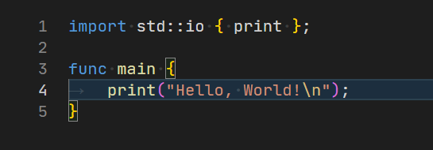
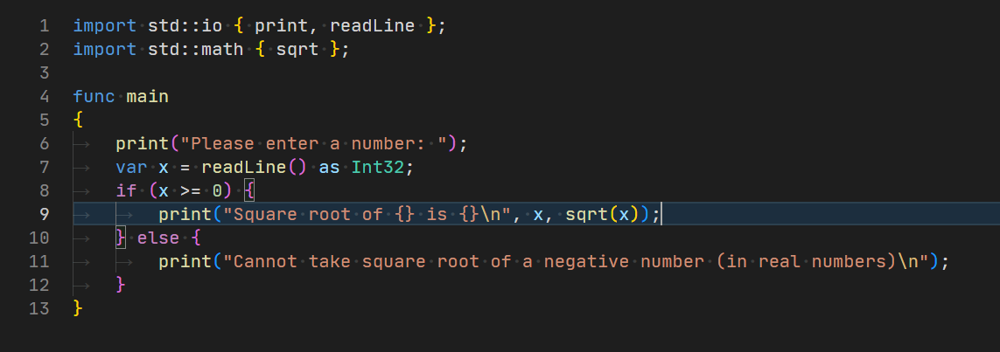
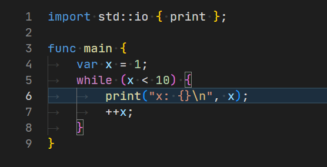
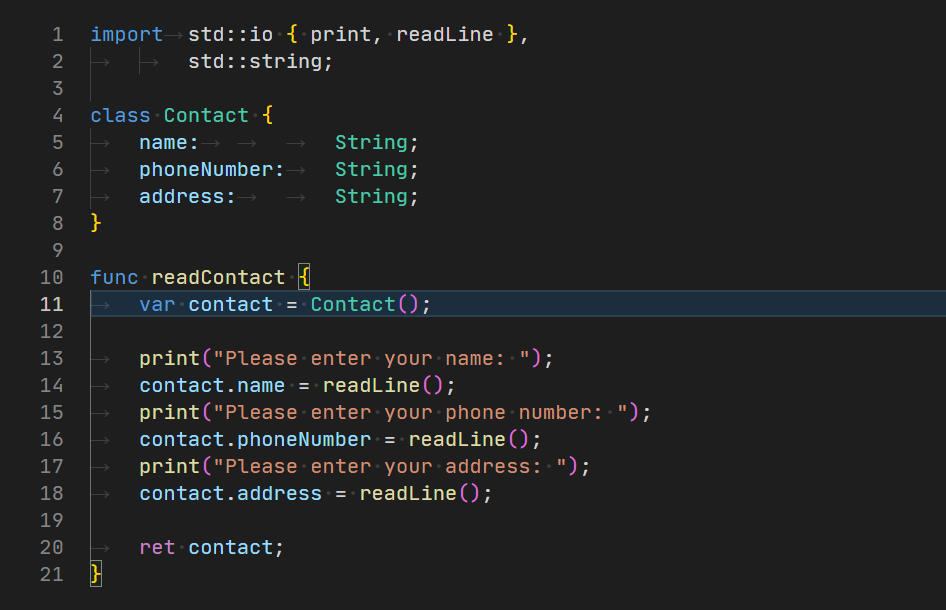
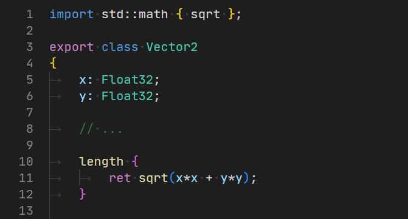
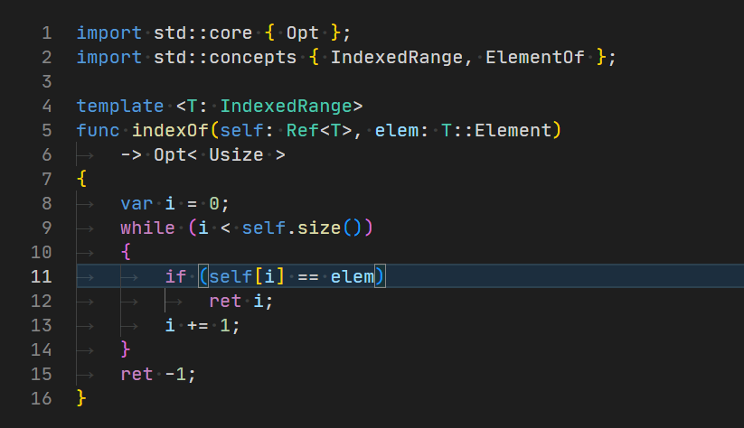

# RigC programming language

**Note: this language is in a <u>very</u> early stage of the development and some features might be missing. This README contains overview of our goals.**

A prototype of **RigC** programming language - the better and simpler C++ language.

## 👋 Hello, World!



## 🚀 Getting started

This language is pre-alpha version. You can download the source code and compile it using [pacc](https://github.com/PoetaKodu/pacc) package manager with:

```bash
pacc build
```

See pacc documentation [here](https://github.com/PoetaKodu/pacc).

## Running RigC code

Right now the code can only be run using our virtual machine using:

```bash
vm <script file>
```

The `vm` command will be located in the `bin/<platform>` directory after you build it.

## ⚽ Goals

1. To create an easier alternative to C++ offering similar features.
2. Abandon C compatibility.
3. Use [module-based](#modules) code splitting from the beginning.
4. Use [concept-based](#metaprogramming) metaprogramming from the beginning.
5. Simplify the syntax
6. Use unified tooling for all platforms.

This goals feel unreachable but sky is the limit so lets see what we can achieve.

### Platforms

Right now RigC can only be run by our virtual machine (`VM/` folder). Plans for future
include:

- writing JIT compiler for our VM
- using LLVM IR as an intermediate language to compile to a native code

## 🧱 Resources

You might want to install [Visual Studio Code extension](https://github.com/PoetaKodu/vscode-rigc).

## ⭐ Features overview

### `if` and `else`



### `while` loop




### Classes



### Modules



### Metaprogramming




// TBD
