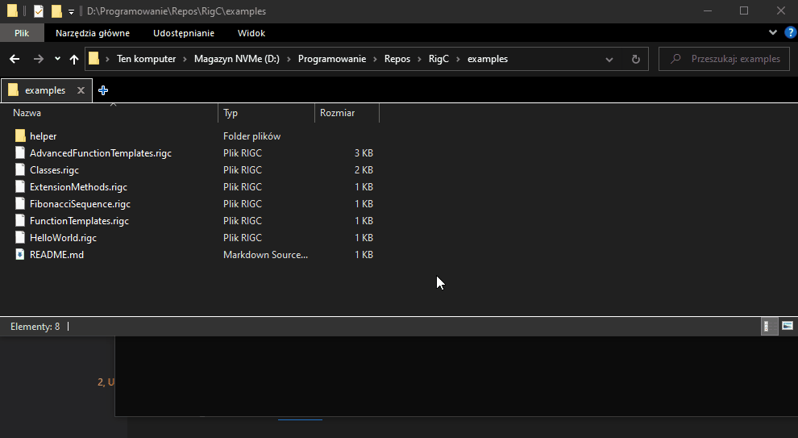

# RigC Examples

> Note: these examples will be changed often.

## Running

Make sure you've [built](https://github.com/PoetaKodu/rigc-lang/#-getting-started) the RigC virtual machine.

Then open a terminal in **the current folder** and run the following command:

```bash
path/to/VM HelloWorld
```

to be more specific, on Windows:
```bash
..\bin\x64\Debug\VM HelloWorld
```

and on Linux:
```bash
../bin/x64/Debug/VM HelloWorld
```

This command will run the `HelloWorld` example using RigC's virtual machine.

To run other examples just replace `HelloWorld` with a filename of a different one (e.g. `AdvancedFunctionTemplates`).



You may also run the virtual machine from any other folder, but you have to make sure you specify a correct script path.
